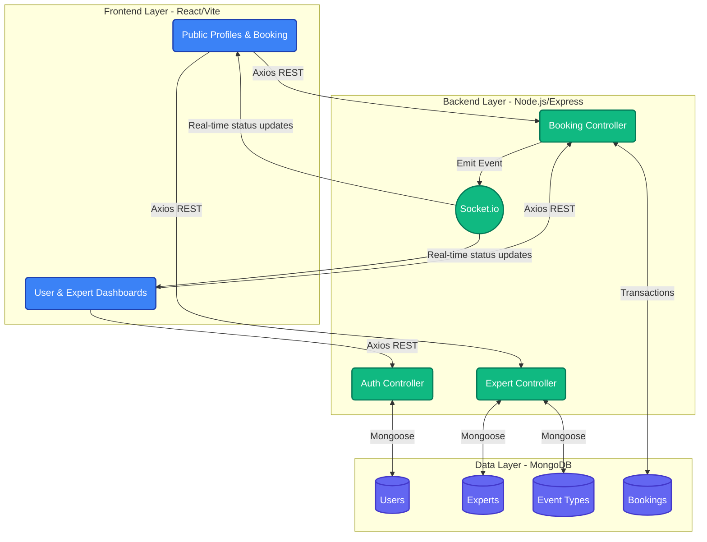

# Real-Time Expert Session Booking System (ExpertBook)

A comprehensive, production-ready full-stack web application designed for professionals to create customizable event types and allow clients to seamlessly book slots with real-time slot availability, AI-powered matching, and advanced analytics.

## 🌟 Key Features

*   **Role-Based Access Control:** Secure user journeys tailored for standard Clients, Experts, and Admins.
*   **AI-Powered Expert Matching:** Integrates with the Gemini API to match users with the perfect expert based on their needs and input.
*   **Intelligent Dashboard & Analytics:** Dynamic dashboards powered by Recharts, offering AI insights, prioritized flow tasks, and detailed engagement metrics.
*   **Automated AI Session Notes:** Automatically generates post-session summaries and briefing notes utilizing Gemini's generative AI capabilities.
*   **Multi-Timezone Support:** Robust scheduling built with `date-fns-tz` to seamlessly handle bookings across different global time zones.
*   **Custom Event Types:** Experts can create specific meeting templates (e.g., 15-minute sync, 60-minute deep dive).
*   **Real-Time Booking:** Built with Socket.io. When a client books a slot, that specific time is instantly marked unavailable for everyone else, preventing double bookings.
*   **Auto-Video Links:** Automatically generates dynamic mock Zoom and Google Meet links upon successful booking completion.
*   **Authentication & Security:** Secure authentication flows powered by Clerk, protecting profiles, routes, and data.

## 🛠️ Tech Stack

*   **Frontend:** React.js, Vite, Tailwind CSS (v4), Zustand (State Management), React Router DOM, Recharts (Data Visualization), Clerk (Auth).
*   **Backend:** Node.js, Express.js.
*   **Database:** Supabase (PostgreSQL) / MongoDB.
*   **Real-Time Communication:** Socket.io.
*   **AI Integration:** Google Generative AI (Gemini API).

## 🚀 Getting Started

### Prerequisites
*   Node.js (v18+ recommended)
*   Supabase or MongoDB Database connection
*   Clerk API Keys (for authentication)
*   Google Gemini API Key

### 1. Backend Setup
1. Open terminal and navigate to server folder: `cd server`
2. Install dependencies: `npm install`
3. Create a `.env` file in the `server` root:
   ```env
   PORT=5000
   DATABASE_URL=your_database_connection_string
   CLERK_SECRET_KEY=your_clerk_secret_key
   GEMINI_API_KEY=your_gemini_api_key
   ```
4. Start the server: `npm run dev`

### 2. Frontend Setup
1. Open a new terminal and navigate to client folder: `cd client`
2. Install dependencies: `npm install`
3. Create a `.env` file in the `client` root:
   ```env
   VITE_CLERK_PUBLISHABLE_KEY=your_clerk_publishable_key
   VITE_API_BASE_URL=http://localhost:5000/api
   ```
4. Start the dev server: `npm run dev`

### 3. Usage Flow
1. Navigate to `http://localhost:5173`.
2. **Register/Login** using the Clerk authentication flow.
3. Access the AI Match page to find suitable experts.
4. Go to your **Expert Dashboard**, manage your profile, and analyze session metrics.
5. Clients can open an expert's public link, view time slots in their local timezone, and book sessions.
6. Check **My Bookings** to view generated Video links, AI-generated session notes, and manage schedule.

## 📂 Folder Structure

```text
e:\full stack\real-time
├── client/                 # React frontend (Vite)
│   ├── src/                # UI components, pages, context, styles
│   └── package.json        # Frontend dependencies
├── server/                 # Node.js Express backend
│   ├── controllers/        # Route logic and request handling
│   ├── models/             # Mongoose database schemas
│   ├── routes/             # Express API routing endpoints
│   ├── utils/              # Helper functions (e.g., logger, notifications)
│   ├── server.js           # Main application entry point & Socket.io setup
│   └── package.json        # Backend dependencies
├── .gitignore              # Root git ignores (protects .env & node_modules)
└── README.md               # Project documentation
```

## 🏗️ System Architecture

This outlines the high-level architecture of the ExpertBook project.

### Tech Stack
-   **Frontend:** React, Vite, Tailwind CSS, Zustand (State Management), React Router.
-   **Backend:** Node.js, Express, MongoDB (Mongoose), Socket.io (Real-time updates).
-   **Authentication:** JSON Web Tokens (JWT) & bcryptjs for password hashing.
-   **Calendar Integration:** `ics` library for generating downloadable calendar files.

### High-Level Data Flow



1.  **Frontend (Client):** 
    -   Handles all UI interactions. 
    -   `Zustand` manages global state like `user` authentication data. 
    -   `Axios` handles the RESTful API calls to the backend.
2.  **Backend (Server):**
    -   Exposes a RESTful API organized by controllers (`authController`, `bookingController`, `expertController`).
    -   Validates endpoints via `authMiddleware` to protect user-specific routes.
    -   `Socket.io` runs alongside the Express server, emitting events like `newBooking` or `statusUpdate` to all connected clients.
3.  **Database (MongoDB):**
    -   Stores structured data across collections (Models: `User`, `Expert`, `Booking`, `EventType`).
    -   Utilizes MongoDB sessions & transactions for advanced booking (to prevent double-booking simultaneously) where applicable.

### Core Models

-   **User:** Represents standard clients. Stores authentication data and an `isExpert` flag.
-   **Expert:** Represents the service provider. Linked to a User. Contains public profile data and `bufferTime`.
-   **EventType:** Types of sessions an expert offers (e.g., 30 Min Video Call).
-   **Booking:** The actual scheduled appointment between a User and an Expert. Includes auto-generated Video Meeting links.

### System Components & Routes

#### Frontend Routes
-   `/` (Public Landing Page)
-   `/experts` (List of Experts)
-   `/:username` (Public Booking Page for an Expert)
-   `/:username/:eventSlug` (Slot Selection Page)
-   `/my-bookings` (Protected: Dashboard for Users to manage their bookings)
-   `/expert-dashboard` (Protected: Dashboard for Experts to manage their Event Types)
-   `/profile` (Protected: Profile management & Role upgrading)

#### Backend API (`/api/*`)
-   `/auth/...` (Login, Register, Profile Management, Become Expert)
-   `/experts/...` (Fetching Experts, Creating initial profiles)
-   `/event-types/...` (CRUD for Experts' offerings)
-   `/bookings/...` (Creating bookings, fetching user/expert bookings, updating statuses)

## 🔄 Workflow

This details the user journey and system processes for different scenarios in the ExpertBook application.

### 1. User Onboarding
-   **Registration:** New users hit the `/register` endpoint (UI: `/register`) providing Name, Email, and Password.
-   **Authentication State:** A JSON Web Token (JWT) is returned and saved to `localStorage` via Zustand's `useAuthStore`.
-   **Role:** By default, all new users are given the `isExpert: false` flag.

### 2. Upgrading to an Expert
-   **Profile Page (`/profile`):** A standard user visits their profile page.
-   **Action:** Click the `Become an Expert` button.
-   **Backend Flow:** Calls `/api/auth/become-expert`. The server sets `user.isExpert = true` and creates an initial `Expert` model document.
-   **Result:** The user gains access to the `Expert Dashboard`.

### 3. Expert Event Type Creation
-   **Expert Dashboard (`/expert-dashboard`):** Only accessible if `user.isExpert === true`.
-   **Creation:** The Expert defines an Event Type (Title, Duration, Location, public URL slug).
-   **Publishing:** Saved to the DB via `/api/event-types`.

### 4. Booking Flow (Client Side)
-   **Public Link:** An Expert shares their public URL (e.g., `/expert/:id` or `/username`).
-   **Listing:** The client views the available standard offerings (Event Types).
-   **Selection:**
    -   Client selects an Event Type.
    -   They pick an available Date and Time from a calendar view (currently standard daily slots from 8 AM to 5 PM).
    -   They provide their Name, Email, Phone, and Notes.
-   **Commit:** A local API call goes to `/api/bookings`.

### 5. Backend Booking Resolution (Transaction & Integrations)
-   **Validation:** The server checks if the exact `Date` and `Time` slot for that `ExpertId` is already booked.
-   *(Optional MVP Flow)* **Transactions:** A MongoDB session opens and locks the booking attempt. If two people book at the exact same millisecond, the first one is committed.
-   **Video Integration:** The `bookingController` auto-generates mock Google Meet (`https://meet.google.com/...`) and Zoom (`https://zoom.us/j/...`) links upon booking instantiation.
-   **Save & Broadcast:** Booking saves. `Socket.io` emits a `newBooking` event.

### 6. Dashboard & Management
-   **My Bookings (`/my-bookings`):** Users view their Upcoming and Past bookings.
-   **Actions:** 
    -   **Add to Calendar:** Generates and downloads a `.ics` file using the `ics` Node.js package.
    -   **Cancel:** Calls a `PATCH` request to toggle booking status. Real-time updates push this to the UI.
    -   **Join Meeting:** Directly links to the auto-generated Zoom/Google Meet URL.

## 📚 Documentation
Please check the specific `.md` files in the root directory for deeper dives into:
*   [Deployment](deployment.md): Steps to host the Frontend on Vercel and Backend on Render/Supabase.

## 📄 License
This MVP is licensed under the MIT License.
